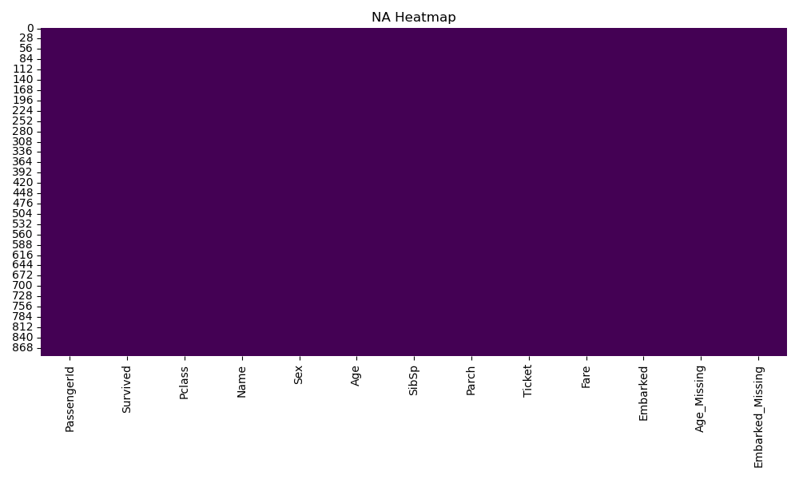
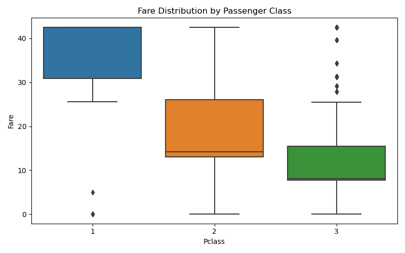

# Data Card: Titanic Dataset (Cleaned)

**Rows:** 891  
**Columns:** 13  

---

## Data Overview
- Source: Titanic dataset
- Target: Survival prediction
- Data Type: Mixed (categorical + numerical)

---

## Cleaning & Processing Steps
1. **EDA**
   - Used `.info()` and `.describe()` to understand dataset.
   - Generated **NA Heatmap** (`na_heatmap.jpg`) to visualize missing values.
   - Plotted **Fare distribution vs Passenger Class** (`fare_vs_pclass.jpg`) to check Fare variation by social class.

2. **Missing Values**
   - Applied **impute & flag** technique for selected columns.
   - Dropped columns with excessive missingness.

3. **Outliers**
   - Treated `Fare` column outliers (IQR/Boxplot method).

---

## Final Dataset
- Saved as `clean_v1.csv`
- Ready for use in ML pipelines.

---

## Visualizations
-   
- 

---
